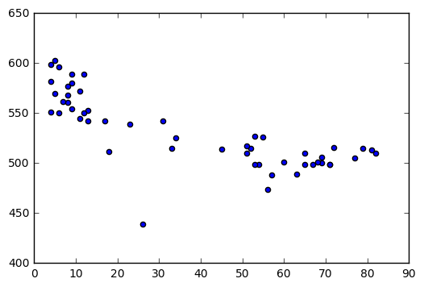

For my latest dataset, I delved into looking at the SAT scores by state. I’ll be exploring where the SAT is most popular, why states with higher participation rates had lower scores and that higher average scores does not necessarily mean that the state is smarter.

#Technology Used

I primarily used Matplotlib in python for the data plotting since most of the charts were not too complicated and it allowed me to give you the cleanest results that are also the easiest to understand.

#Methodology 

Since the preexisting data set was clean, I decided to eyeball the data. In looking through the first several rows, I picked up on a theme. Of the top fifteen states in terms of their participation rate in the SAT, fourteen of them came from the east coast. All had at least a participation rate of 60% whereas the participation rate for the country came in at just 45%. Further, as you can tell from the first chart, more than half of the states (27) have a participation rate of less than 35%. And, of those 27, none of them are on the coast.

Next, I went to see if there was a difference in the test scores for the states with low turnout rate vs those with high turnout rate. On the two scatter plots below, we see how as the participation rates increase, the scores on Math and Verbal begin to decrease. First, it’s important to note that the states that had the higher average scores on both the Math and Verbal sections are not from the coasts. I will prove this soon but for now trust me when I say that it does not necessarily mean that the higher scoring states are smarter or have more smarter people than those who live on the coast. But, for now back to the scatterplots. There’s really two parts to the charts that need to be examined. The half of the chart that has a participation rate of less than 35% and the other half with a participation rate of over 50%.  For the higher scorers, there is a negative trend that as participation increases the average score goes down. For the higher participation states, it’s a little bit harder to say. At best, as participation increases average scores go down but it’s minimal at best and more likely there is no trend at all. 

So, while this is all well and good, there’s still one piece of information I have not done a sufficient job on. Why states with lower turnout did better and why they aren’t necessarily smarter. In those parts of the country where the turnout is low is due to the fact that those areas of the country are big on taking the ACT. Those states encourage students to take the ACT and typically the ones taking the SAT are those who take both tests and those individuals tend to be applying to some of the more academically rigorous schools. Hence, those schools with low turnout but high scores are so because their testing pool is stronger than the pools on the east coast. Ultimately this makes sense. Think about it. If only the smartest people take the exam you not only have much higher scores across the board, but you also remove a substantial amount of the testers who would have scored less than the mean.

![Image Name] (../images/scatterplot1.jpg)

# Conclusion

While seeing the average test scores is important to see how states are doing comparatively on exams, we also have to keep in mind whether or not the people that make up each data set are comparable. It’s important to keep these things in mind when you read through a data set.

