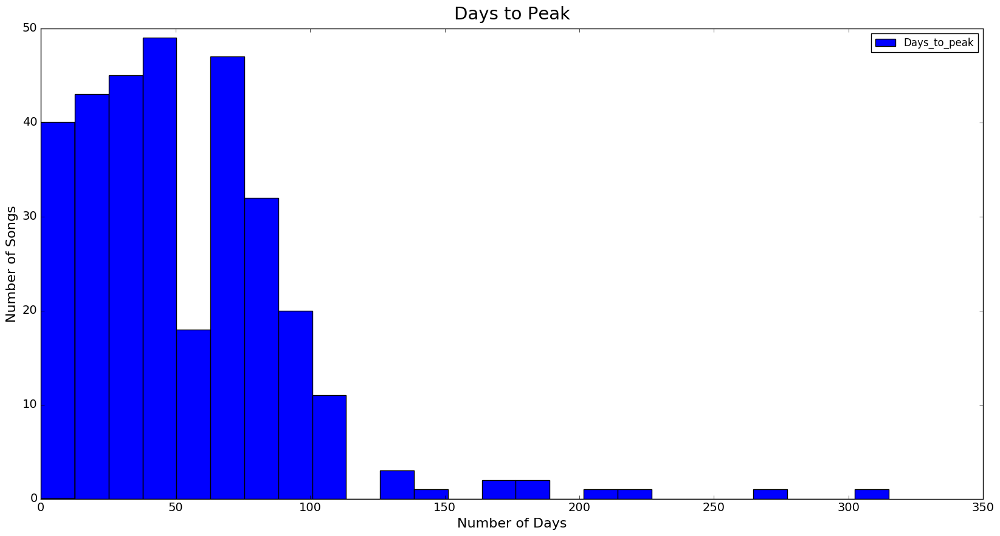
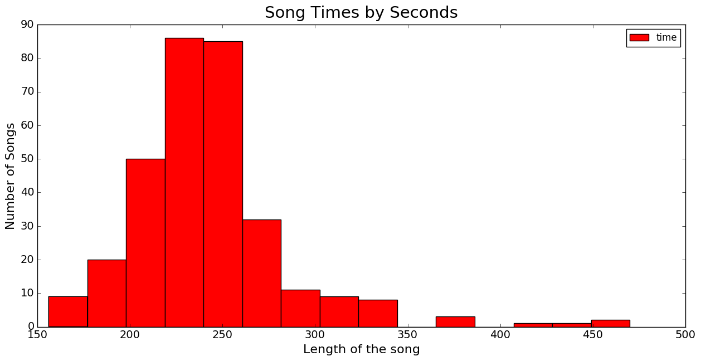

Remember the 2000s? What about the 'Thong Song'? Well, a long time ago, before Lorde, One Direction and even the solo career of Justin Timberlake, there was Sisqo, Destiny's Child and whole bunch of other artists who you may have forgotten or are too young to remember. In any case, today I will be going through a dataset involving the billboard hits from 2000.
##
When I was first given my data set. It looked like it was put through a blender. Values were missing, there were two different spellings of R&B, the time of the song was listed as if it was telling you what time it was in regards to military time among other issues. After clearing up all of these different issues, I finally got down to trying to come up with some of my thoughts about what I was looking for in the data and what some of my concerns were. 
#
A little description on the data before we jump in. The dataset contains over 300 songs that made the Billboard Top 100 in 2000. These songs also include their artist, genre, the album the song was on, the length of the song,  the day they entered the charts, the day they peaked, and their ranking for each week they were in the top 100. A couple things that I needed to keep in mind about the dataset were the following. First, rankings do not indicate whether or not the song is good but rather how popular it is based on it's airplay across the country. Second, the way they categorize the genre may not be how we categorize it today. That's not to say that one generation defined what fit under what song better but rather how the definition has changed over the past seventeen years.
#
When I parsed through the data, I wanted to find out two things. One, how long did it take for songs to peak before they started two decline. Second, how long were these songs typically.

On the first chart, we see how the songs took until the peaked. It comes across as a normal distribution with the one bucket just past the 50 day mark where it drops off. It still performs consistently with most songs being on the charts for 28-84 days. After 100 days, few songs will continue to remain on the chart. As you get further out, it gets even smaller.

On our next chart we see that average song length falls right at the four minute mark. iIn fact, most of the songs are normally distributed over the 3-5 minute period.  There are a handful that go beyond the six minute interval but overall it is pretty well contained.
